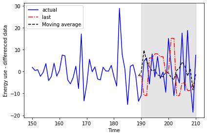
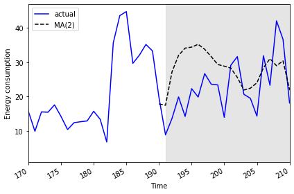

:::::::::::::::::::::::::::::::::::::: questions 

- How can we analyze time-series data with trends?

::::::::::::::::::::::::::::::::::::::::::::::::

::::::::::::::::::::::::::::::::::::: objectives

- Create a stationary time-series.
- Test for autocorrelation of time series values.

::::::::::::::::::::::::::::::::::::::::::::::::

## Introduction

In the previous section, we used baseline metrics to forecast one or more
timesteps of a time-series dataset. These forecasts help demonstrate some of the
characteristic features of time-series, but as we saw when we evaluated the 
results they may not make very accurate forecasts. There are some types of 
random time-series data for which using a baseline metric to forecast a single
timestamp ahead is the only option. Since that doesn't apply to the smart 
meter data - that is, power consumption values are not random - we will pass
over that topic for now.

Instead, the smart meter data have characteristics that make them good 
candidates for methods that account for trends, autoregression, and one or 
more types of seasonality. We will develop these concepts over the next several
lessons, beginning here with autocorrelation and the use of moving averages
to make forecasts using autocorrelated data.

## About the code

The code used in this lesson is based on and, in some cases, a direct 
application of code used in the Manning Publications title, *Time series forecasting in Python*, by Marco Peixeiro.

> Peixeiro, Marco. Time Series Forecasting in Python. [First edition]. Manning Publications Co., 2022.

The original code from the book is made available under an 
[Apache 2.0 license](https://github.com/marcopeix/TimeSeriesForecastingInPython/blob/master/LICENSE.txt). Use and application of the code in these materials is within
the license terms, although this lesson itself is licensed under a Creative Commons
[CC-BY 4.0 license](https://creativecommons.org/licenses/by/4.0/legalcode). Any
further use or adaptation of these materials should cite the source code
developed by Peixeiro:

> Peixeiro, Marco. Timeseries Forecasting in Python [Software code]. 2022.
Accessed from [https://github.com/marcopeix/TimeSeriesForecastingInPython](https://github.com/marcopeix/TimeSeriesForecastingInPython).

## Create a subset to demonstrate autocorrelation

As we did in the previous episode, rather than read a dataset that is ready
for analysis we are going to read one of the smart meter datasets and create a
subset that demonstrates the characteristics of interest for this section of
the lesson.

First we will import the necessary libraries. Note that in additional to Pandas,
Numpy, and Matplotlib we are also importing modules from ```statsmodels``` and
```sklearn```. These are Python libraries that come with many methods for
modeling and machine learning.

```python
import pandas as pd
import numpy as np
import matplotlib.pyplot as plt
from statsmodels.tsa.stattools import adfuller
from statsmodels.graphics.tsaplots import plot_acf
from statsmodels.tsa.statespace.sarimax import SARIMAX
from sklearn.metrics import mean_squared_error
from sklearn.metrics import mean_absolute_error
```

Read the data. In this case we are using just a single smart meter.

```python
df = pd.read_csv("../../data/ladpu_smart_meter_data_01.csv")
print(df.info())
```
```output
<class 'pandas.core.frame.DataFrame'>
RangeIndex: 105012 entries, 0 to 105011
Data columns (total 5 columns):
 #   Column         Non-Null Count   Dtype  
---  ------         --------------   -----  
 0   INTERVAL_TIME  105012 non-null  object 
 1   METER_FID      105012 non-null  int64  
 2   START_READ     105012 non-null  float64
 3   END_READ       105012 non-null  float64
 4   INTERVAL_READ  105012 non-null  float64
dtypes: float64(3), int64(1), object(1)
memory usage: 4.0+ MB
None
```

Set the datetime index and resample to a daily frequency.

```python
df.set_index(pd.to_datetime(df["INTERVAL_TIME"]), inplace=True)
df.sort_index(inplace=True)
print(df.info())
```

```output
<class 'pandas.core.frame.DataFrame'>
DatetimeIndex: 105012 entries, 2017-01-01 00:00:00 to 2019-12-31 23:45:00
Data columns (total 5 columns):
 #   Column         Non-Null Count   Dtype  
---  ------         --------------   -----  
 0   INTERVAL_TIME  105012 non-null  object 
 1   METER_FID      105012 non-null  int64  
 2   START_READ     105012 non-null  float64
 3   END_READ       105012 non-null  float64
 4   INTERVAL_READ  105012 non-null  float64
dtypes: float64(3), int64(1), object(1)
memory usage: 4.8+ MB
None
```

```python
daily_data = pd.DataFrame(df.resample("D")["INTERVAL_READ"].sum())
print(daily_data.head())
```

```output
               INTERVAL_READ
INTERVAL_TIME               
2017-01-01           11.7546
2017-01-02           15.0690
2017-01-03           11.6406
2017-01-04           22.0788
2017-01-05           12.8070
```

Subset to January - July, 2019 and plot the data.

```python
jan_july_2019 = daily_data.loc["2019-01": "2019-07"].copy()
jan_july_2019["INTERVAL_READ"].plot()
```


The above plot demonstrates a gradual trend towards increased power consumption
through late spring and into summer. This is expected - power consumption 
in US households tends to increase as the weather becomes warmer and people
begin to use air conditioners or evaporative coolers. 

## Differencing and autocorrelation

In order to make a forecast using the moving average model, however, 
the data need to be stationary. That is, we need to remove trends from 
the data. We can test for stationarity using the
```adfuller``` function from ```statsmodels```.

```python
adfuller_test = adfuller(jan_july_2019["INTERVAL_READ"])
print(f'ADFuller result: {adfuller_test[0]}')
print(f'p-value: {adfuller_test[1]}')
```

```output
ADFuller result: -2.533089941397639
p-value: 0.10762933815081588
```

The p-value above is greater than 0.05, which in this case indicates that the
data are not stationary. That is, there is a trend in the data.

We also want to test for autocorrelation. 

```python
plot_acf(jan_july_2019["INTERVAL_READ"], lags=30)
plt.tight_layout()
```


The plot above shows significant autocorrelation up to the 16th lag. Before we
can make forecasts on the data, we need to make the data stationary by 
removing the trend using a technique called *differencing*. Differencing also
reduces the amount of autocorrelation in the data.

Differencing data this way creates a Numpy array of values that represent the
difference between one *INTERVAL_READ* value and the next. We can see this
by comparing the head of the jan_july_2019 dataframe with the first five 
differenced values.


```python
jan_july_2019_differenced = np.diff(jan_july_2019["INTERVAL_READ"], n=1)
print("Head of dataframe:", jan_july_2019.head())
print("\nDifferenced values:", jan_july_2019_differenced[:5])
```

```output
Head of dataframe:                INTERVAL_READ
INTERVAL_TIME               
2019-01-01            7.5324
2019-01-02           10.2534
2019-01-03            6.8544
2019-01-04            5.3250
2019-01-05            7.5480

Differenced values: [ 2.721  -3.399  -1.5294  2.223   2.3466]
```

Plotting the result shows that there are no obvious trends in the differenced
data.

```python
fig, ax = plt.subplots()

ax.plot(jan_july_2019_differenced)
ax.set_xlabel('Time')
ax.set_ylabel('Energy consumption')

fig.autofmt_xdate()
plt.tight_layout()
```


Evaluating the AD Fuller test on the difference data indicates that the
data are stationary. 

```python
adfuller_test = adfuller(jan_july_2019_differenced)
print(f'ADFuller result: {adfuller_test[0]}')
print(f'p-value: {adfuller_test[1]}')
```

```output
ADFuller result: -7.966077912452976
p-value: 2.8626643210939594e-12
```
The autocorrelation plot still shows some significant autocorrelation up to
lag 2. We will use this information to supply the *order* parameter for the 
moving average model, below.


## Moving average forecast

For our training data, we will use the 90% of the dataset. The remaining
10% of the data will be used to evaluate the performance of the moving 
average forecast in comparison with a baseline forecast.

Since the differenced data is a numpy array, we also need to convert it to
a dataframe.

```python
jan_july_2019_differenced = pd.DataFrame(jan_july_2019_differenced,
                                         columns=["INTERVAL_READ"])

train = jan_july_2019_differenced[:int(round(len(jan_july_2019_differenced) * .9, 0))] # ~90% of data
test = jan_july_2019_differenced[int(round(len(jan_july_2019_differenced) * .9, 0)):] # ~10% of data        
print("Training data length:", len(train))
print("Test data length:", len(test))
```

```output
Training data length: 190
Test data length: 21
```

We can plot the original and differenced data together. The shaded area is
the date range for which we will be making and evaluating forecasts.

```python
fig, (ax1, ax2) = plt.subplots(nrows=2, ncols=1, sharex=True)
 
ax1.plot(jan_july_2019["INTERVAL_READ"].values)
ax1.set_xlabel('Time')
ax1.set_ylabel('Energy use')
ax1.axvspan(184, 211, color='#808080', alpha=0.2)
 
ax2.plot(jan_july_2019_differenced["INTERVAL_READ"])
ax2.set_xlabel('Time')
ax2.set_ylabel('Energy use - differenced data')
ax2.axvspan(184, 211, color='#808080', alpha=0.2)
 
fig.autofmt_xdate()
plt.tight_layout()
```


We are going to evaluate the performance of the moving average forecast
against a baseline forecast based on the last known value. Since we will be
using and building on these methods throughout this lesson, we will create
functions for each forecast.

The ```last_known()``` function is a more flexible version of the process
used in the previous episode to calculate a baseline forecast. In that case
we used single value - the last known meter reading from the training dataset -
and applied it as a forecast to the entire test set. In our updated function,
we are passing *horizon* and *window* arguments that allow us to pull 
values from a moving frame of reference within the differenced data.

The ```moving_average()``` function is an implementation of the
*seasonal auto-regressive moving average* model that is included in the
```statsmodels``` library. 

```python
def last_known(data, training_len, horizon, window):
    total_len = training_len + horizon
    pred_last_known = []
    
    for i in range(training_len, total_len, window):
        subset = data[:i]
        last_known = subset.iloc[-1].values[0]
        pred_last_known.extend(last_known for v in range(window))
    
    return pred_last_known

def moving_average(data, training_len, horizon, ma_order, window):
    total_len = training_len + horizon
    pred_MA = []
    
    for i in range(training_len, total_len, window):
        model = SARIMAX(data[:i], order=(0,0, ma_order)) 
        res = model.fit(disp=False)
        predictions = res.get_prediction(0, i + window - 1)
        oos_pred = predictions.predicted_mean.iloc[-window:]
        pred_MA.extend(oos_pred)
        
    return pred_MA
```

Both functions take the differenced dataframe as input and return a list
of predicted values that is equal to the length of the test dataset.

```python
pred_df = test.copy()
 
TRAIN_LEN = len(train)
HORIZON = len(test)
ORDER = 2
WINDOW = 2

pred_last_value = last_known(jan_july_2019_differenced, TRAIN_LEN, HORIZON, WINDOW)
pred_MA = moving_average(jan_july_2019_differenced, TRAIN_LEN, HORIZON, ORDER, WINDOW)

pred_df['pred_last_value'] = pred_last_value
pred_df['pred_MA'] = pred_MA
 
print(pred_df.head())
```

```output
     INTERVAL_READ  pred_last_value   pred_MA
189       -13.5792           -1.863 -1.870535
190       -10.8660           -1.863 -0.379950
191         4.8054          -10.866  9.760944
192         6.2280          -10.866  4.751856
193        -5.6718            6.228  2.106354
```

Plotting the data allows for a visual comparison of the forecasts.

```python
fig, ax = plt.subplots()
                      
ax.plot(jan_july_2019_differenced[150:]['INTERVAL_READ'], 'b-', label='actual')           
ax.plot(pred_df['pred_last_value'], 'r-.', label='last')     
ax.plot(pred_df['pred_MA'], 'k--', label='Moving average')          
 
ax.axvspan(190, 210, color='#808080', alpha=0.2)         
ax.legend(loc=2)                                         
 
ax.set_xlabel('Time')
ax.set_ylabel('Energy use - differenced data')

plt.tight_layout()
```



This time we will use the ```mean_squared_error``` function from the 
```sklearn``` library to evaluate the results.

```python
mse_last = mean_squared_error(pred_df['INTERVAL_READ'], pred_df['pred_last_value'])
mse_MA = mean_squared_error(pred_df['INTERVAL_READ'], pred_df['pred_MA'])
 
print("Last known forecast, mean squared error:", mse_last)
print("Moving average forecast, mean squared error:", mse_MA)
```

```output
Last known forecast, mean squared error: 185.5349359527273
Moving average forecast, mean squared error: 86.16289030738947
```

We can see that the moving average forecast performs much better than the last
known value baseline forecast.

## Transform the forecast to original scale

Because we differenced our data above in order to apply a moving average
forecast, we now need to transform the data back to its original scale. To do
this, we apply the numpy ```cumsum()``` method to calculate the cumulative sums
of the values in the differenced dataset. We then map these sums to their 
corresponding rows of the original data.

The transformed data are only being applied to the rows of the source data that
were used for the test dataset, so we can use the ```tail()``` function to
inspect the result.

```python
jan_july_2019['pred_usage'] = pd.Series() 
jan_july_2019['pred_usage'][190:] = jan_july_2019['INTERVAL_READ'].iloc[190] + pred_df['pred_MA'].cumsum() 
print(jan_july_2019.tail())
```

```output
               INTERVAL_READ  pred_usage
INTERVAL_TIME                           
2019-07-27           23.2752   31.008305
2019-07-28           42.0504   28.974839
2019-07-29           36.6444   30.387655
2019-07-30           18.0828   22.025803
2019-07-31           25.5774   20.781842
```

We can plot the result to compare the transformed forecasts against the
actual daily power consumption. 

```python
fig, ax = plt.subplots()
 
ax.plot(jan_july_2019['INTERVAL_READ'].values, 'b-', label='actual') 
ax.plot(jan_july_2019['pred_usage'].values, 'k--', label='MA(2)') 
 
ax.legend(loc=2)
 
ax.set_xlabel('Time')
ax.set_ylabel('Energy consumption')
ax.axvspan(191, 210, color='#808080', alpha=0.2)
ax.set_xlim(170, 210)
 
fig.autofmt_xdate()
plt.tight_layout()
```




Finally, to evaluate the performance of the moving average forecast against the
actual values in the undifferenced data, we use the ```mean_absolute_error```
from the ```sklearn``` library.

```python
mae_MA_undiff = mean_absolute_error(jan_july_2019['INTERVAL_READ'].iloc[191:], 
                                    jan_july_2019['pred_usage'].iloc[191:])
 
print("Mean absolute error of moving average forecast", mae_MA_undiff)
```

```output
Mean absolute error of moving average forecast 8.457690692889582
```

::::::::::::::::::::::::::::::::::::: keypoints

- Use differencing to make time-series stationary.
- ```statsmodels``` is a Python library with time-series methods built in.

:::::::::::::::::::::::::::::::::::::::::::::::
