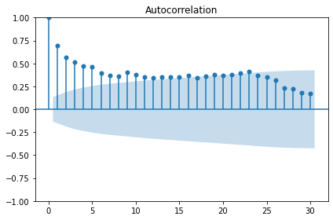

:::::::::::::::::::::::::::::::::::::: questions 

- How can we analyze time-series data with trends?

::::::::::::::::::::::::::::::::::::::::::::::::

::::::::::::::::::::::::::::::::::::: objectives

- Create a stationary time-series.
- Test for autocorrelation of time series values.

::::::::::::::::::::::::::::::::::::::::::::::::

## Introduction

In the previous section, we used baseline metrics to forecast one or more
timesteps of a time-series dataset. These forecasts help demonstrate some of the
characteristic features of time-series, but as we saw when we evaluated the 
results they may not make very accurate forecasts. There are some types of 
random time-series data for which using a baseline metric to forecast a single
timestamp ahead is the only option. Since that doesn't apply to the smart 
meter data - that is, power consumption values are not random - we will pass
over that topic for now.

Instead, the smart meter data have characteristics that make them good 
candidates for methods that account for trends, auto-correlation, and one or 
more types of seasonality. We will develop these concepts over the next several
lessons, beginning here with autocorrelation and the use of moving averages
to make forecasts using autocorrelated data.

## About the code

The code used in this lesson is based on and, in some cases, a direct 
application of code used in the Manning Publications title, *Time series forecasting in Python*, by Marco Peixeiro.

> Peixeiro, Marco. Time Series Forecasting in Python. [First edition]. Manning Publications Co., 2022.

The original code from the book is made available under an 
[Apache 2.0 license](https://github.com/marcopeix/TimeSeriesForecastingInPython/blob/master/LICENSE.txt). Use and application of the code in these materials is within
the license terms, although this lesson itself is licensed under a Creative Commons
[CC-BY 4.0 license](https://creativecommons.org/licenses/by/4.0/legalcode). Any
further use or adaptation of these materials should cite the source code
developed by Peixeiro:

> Peixeiro, Marco. Timeseries Forecasting in Python [Software code]. 2022.
Accessed from [https://github.com/marcopeix/TimeSeriesForecastingInPython](https://github.com/marcopeix/TimeSeriesForecastingInPython).

## Create a subset to demonstrate autocorrelation

As we did in the previous episode, rather than read a dataset that is ready
for analysis we are going to read one of the smart meter datasets and create a
subset that demonstrates the characteristics of interest for this section of
the lesson.

First we will import the necessary libraries. Note that in additional to Pandas,
Numpy, and Matplotlib we are also importing modules from ```statsmodels``` and
```sklearn```. These are Python libraries that come with many methods for
modeling and machine learning.

```python
import pandas as pd
import numpy as np
import matplotlib.pyplot as plt
from statsmodels.tsa.stattools import adfuller
from statsmodels.graphics.tsaplots import plot_acf
from statsmodels.tsa.statespace.sarimax import SARIMAX
from sklearn.metrics import mean_squared_error
from sklearn.metrics import mean_absolute_error
```

Read the data. In this case we are using just a single smart meter.

```python
df = pd.read_csv("../../data/ladpu_smart_meter_data_01.csv")
print(df.info())
```
```output
<class 'pandas.core.frame.DataFrame'>
RangeIndex: 105012 entries, 0 to 105011
Data columns (total 5 columns):
 #   Column         Non-Null Count   Dtype  
---  ------         --------------   -----  
 0   INTERVAL_TIME  105012 non-null  object 
 1   METER_FID      105012 non-null  int64  
 2   START_READ     105012 non-null  float64
 3   END_READ       105012 non-null  float64
 4   INTERVAL_READ  105012 non-null  float64
dtypes: float64(3), int64(1), object(1)
memory usage: 4.0+ MB
None
```

Set the datetime index and resample to a daily frequency.

```python
df.set_index(pd.to_datetime(df["INTERVAL_TIME"]), inplace=True)
df.sort_index(inplace=True)
print(df.info())
```

```output
<class 'pandas.core.frame.DataFrame'>
DatetimeIndex: 105012 entries, 2017-01-01 00:00:00 to 2019-12-31 23:45:00
Data columns (total 5 columns):
 #   Column         Non-Null Count   Dtype  
---  ------         --------------   -----  
 0   INTERVAL_TIME  105012 non-null  object 
 1   METER_FID      105012 non-null  int64  
 2   START_READ     105012 non-null  float64
 3   END_READ       105012 non-null  float64
 4   INTERVAL_READ  105012 non-null  float64
dtypes: float64(3), int64(1), object(1)
memory usage: 4.8+ MB
None
```

```python
daily_data = pd.DataFrame(df.resample("D")["INTERVAL_READ"].sum())
print(daily_data.head())
```

```output
               INTERVAL_READ
INTERVAL_TIME               
2017-01-01           11.7546
2017-01-02           15.0690
2017-01-03           11.6406
2017-01-04           22.0788
2017-01-05           12.8070
```

Subset to January - July, 2019 and plot the data.

```python
jan_july_2019 = daily_data.loc["2019-01": "2019-07"].copy()
jan_july_2019["INTERVAL_READ"].plot()
```


The above plot demonstrates a gradual trend towards increased power consumption
through late spring and into summer. This is expected - power consumption 
in US households tends to increase as the weather becomes warmer and people
begin to use air conditioners or evaporative coolers. 

In order to make a forecast, however, the data need to be stationary. That is,
we need to remove trends from the data. We can test for stationarity using the
```adfuller``` function from ```statsmodels```.

```python
adfuller_test = adfuller(jan_july_2019["INTERVAL_READ"])
print(f'ADFuller result: {adfuller_test[0]}')
print(f'p-value: {adfuller_test[1]}')
```

```output
ADFuller result: -2.533089941397639
p-value: 0.10762933815081588
```

The p-value above is greater than 0.05, which in this case indicates that the
data are not stationary. That is, there is a trend in the data.

We also want to test for autocorrelation. As noted above, our data are not
random - recorded values of power consumption can be dependent on other
variables, including in this case the previous value. This is known as
*autocorrelation*, and the ```statsmodels``` library also a function for
plotting the presence of autocorrelation. 

```python
plot_acf(jan_july_2019["INTERVAL_READ"], lags=30)
plt.tight_layout()
```



The plot above shows significant autocorrelation up to the 16th lag. Before we
can make forecasts on the data, we need to make the data stationary by 
removing the trend using a technique called *differencing*. Differencing also
reduces the amount of autocorrelation in the data.

Differencing data this way creates a Numpy array of values that represent the
difference between one *INTERVAL_READ* value and the next. We can see this
by comparing the head of the jan_july_2019 dataframe with the first five 
differenced values.


```python
jan_july_2019_differenced = np.diff(jan_july_2019["INTERVAL_READ"], n=1)
print("Head of dataframe:", jan_july_2019.head())
print("\nDifferenced values:", jan_july_2019_differenced[:5])
```

```output
Head of dataframe:                INTERVAL_READ
INTERVAL_TIME               
2019-01-01            7.5324
2019-01-02           10.2534
2019-01-03            6.8544
2019-01-04            5.3250
2019-01-05            7.5480

Differenced values: [ 2.721  -3.399  -1.5294  2.223   2.3466]
```

Plotting the result shows that there are no obvious trends in the differenced
data.

```python
fig, ax = plt.subplots()

ax.plot(jan_july_2019_differenced)
ax.set_xlabel('Time')
ax.set_ylabel('Energy consumption')

fig.autofmt_xdate()
plt.tight_layout()
```


Evaluating the AD Fuller test on the difference data indicates that the
data are stationary. 

```python
adfuller_test = adfuller(jan_july_2019_differenced)
print(f'ADFuller result: {adfuller_test[0]}')
print(f'p-value: {adfuller_test[1]}')
```

```output
ADFuller result: -7.966077912452976
p-value: 2.8626643210939594e-12
```


::::::::::::::::::::::::::::::::::::: keypoints

- Use differencing to make time-series stationary.
- ```statsmodels``` is a Python library with time-series methods built in.

:::::::::::::::::::::::::::::::::::::::::::::::
