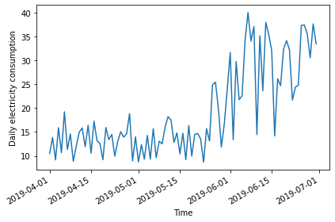
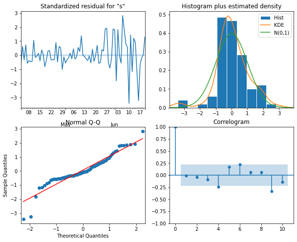

:::::::::::::::::::::::::::::::::::::: questions 

- How can we forecast non-stationary time-series?

::::::::::::::::::::::::::::::::::::::::::::::::

::::::::::::::::::::::::::::::::::::: objectives

- Explain the *d* parameter of the SARIMAX model's *order(p, d, q)*
argument.

::::::::::::::::::::::::::::::::::::::::::::::::

## Introduction

The smart meter data with which we have been modeling forecasts throughout
this lesson are non-stationary. That is, there are trends in the data. An
assumption of the moving average and autoregressive models that we've looked
at is that the data are stationary. 

So far, we have been manually differencing the data and making forecasts
with the differenced data, then transforming the forecasts back to the scale
of the source dataset. In this section, we look at the autoregressive
integrated moving average or ARIMA(p,d, q) model. In this model, as before, 
the *p* is the order of the AR(p) process and the *q* is the order of the
MA(q) process. Now we will further specify the *d* parameter, which is the 
integration order. 

## About the code

The code used in this lesson is based on and, in some cases, a direct 
application of code used in the Manning Publications title, *Time series forecasting in Python*, by Marco Peixeiro.

> Peixeiro, Marco. Time Series Forecasting in Python. [First edition]. Manning Publications Co., 2022.

The original code from the book is made available under an 
[Apache 2.0 license](https://github.com/marcopeix/TimeSeriesForecastingInPython/blob/master/LICENSE.txt). Use and application of the code in these materials is within
the license terms, although this lesson itself is licensed under a Creative Commons
[CC-BY 4.0 license](https://creativecommons.org/licenses/by/4.0/legalcode). Any
further use or adaptation of these materials should cite the source code
developed by Peixeiro:

> Peixeiro, Marco. Timeseries Forecasting in Python [Software code]. 2022.
Accessed from [https://github.com/marcopeix/TimeSeriesForecastingInPython](https://github.com/marcopeix/TimeSeriesForecastingInPython).

## Create the data subset


In order to more fully demonstrate the integration order of the process, we are
going to generate a different subset that needs to be differenced twice before
it is stationary. That is, whereas all of our time-series so far have only
required first order differencing to become stationary, this subset will
require second order differencing.

First, import the required libraries.

```python
import pandas as pd
import numpy as np
import matplotlib.pyplot as plt
from statsmodels.tsa.stattools import adfuller
from statsmodels.graphics.tsaplots import plot_acf
from statsmodels.graphics.tsaplots import plot_pacf
from statsmodels.tsa.statespace.sarimax import SARIMAX
from sklearn.metrics import mean_squared_error
from sklearn.metrics import mean_absolute_error
```

We will reuse our function for reading, subsetting, and resampling the 
data.

```python
def subset_resample(fpath, sample_freq, start_date, end_date=None):
    df = pd.read_csv(fpath)
    df.set_index(pd.to_datetime(df["INTERVAL_TIME"]), inplace=True)
    df.sort_index(inplace=True)
    if end_date:
        date_subset = df.loc[start_date: end_date].copy()
    else:
        date_subset = df.loc[start_date].copy()
    resampled_data = date_subset.resample(sample_freq)
    return resampled_data
```

This time we call our function with different arguments for the file path
and the date range of the subset.

```python
fp = "../../data/ladpu_smart_meter_data_02.csv"
data_subset_resampled = subset_resample(fp, "D", "2019-04", end_date="2019-06")
print("Data type of returned object:", type(data_subset_resampled))
```

```output
Data type of returned object: <class 'pandas.core.resample.DatetimeIndexResampler'>
```

The object returned by the ```subset_resample``` function is a datetime group,
so as before we create a dataframe from an aggregation of the grouped
statistics.

```python
daily_usage = data_subset_resampled['INTERVAL_READ'].agg([np.sum])
print(daily_usage.info())
print(daily_usage.head())
```

```output
<class 'pandas.core.frame.DataFrame'>
DatetimeIndex: 91 entries, 2019-04-01 to 2019-06-30
Freq: D
Data columns (total 1 columns):
 #   Column  Non-Null Count  Dtype  
---  ------  --------------  -----  
 0   sum     91 non-null     float64
dtypes: float64(1)
memory usage: 1.4 KB
None
                   sum
INTERVAL_TIME         
2019-04-01     10.4928
2019-04-02     13.8258
2019-04-03      9.1350
2019-04-04     15.8994
2019-04-05     10.6644
```

Plot the data - the date range is smaller than previous examples, and there is
a notable trend in increased power consumption toward the end of the date 
range.



## Determine the integration order of the process

Not surprisingly, the AD Fuller statistic indicates that the time-series is not
stationary.

```python
ADF_result = adfuller(daily_usage['sum'])     
print(f'ADF Statistic: {ADF_result[0]}')      
print(f'p-value: {ADF_result[1]}')
```

```output
ADF Statistic: 0.043745771110572505
p-value: 0.9620037401385906
```

However, after differencing the data the AD Fuller statistic is lower but 
still indicates that the data are not stationary.

```python
daily_usage_diff = np.diff(daily_usage['sum'], n = 1)

ADF_result = adfuller(daily_usage_diff)     
print(f'ADF Statistic: {ADF_result[0]}')      
print(f'p-value: {ADF_result[1]}')   
```

```output
ADF Statistic: -2.552170893387957
p-value: 0.10329088087274496
```

If we difference the differenced data, the AD Fuller statistic and p-value
now indicate that our time-series is stationary.

```python
daily_usage_diff2 = np.diff(daily_usage_diff, n=1)        
 
ad_fuller_result = adfuller(daily_usage_diff2)    
 
print(f'ADF Statistic: {ad_fuller_result[0]}')
print(f'p-value: {ad_fuller_result[1]}')
```

```output
ADF Statistic: -11.308460105521412
p-value: 1.2561555209524703e-20
```

As noted, up until now we have been forecasting and fitting models with
training data subset from the differenced time-series. Because we are now
integration order to our model, we will be fitting models and making forecasts
using the non-stationary source data.

Since we needed to use second order differencing to make our time-series
stationary, the value *d* of the ARIMA(p, d, q) integration order is 2.

First, create training and test data sets.

```python
train = daily_usage[:int(len(daily_usage) * .9)].copy() # ~90% of data
test = daily_usage[int(len(daily_usage) * .9):].copy() # ~10% of data        
print("Training data length:", len(train))
print("Test data length:", len(test))
```

```output
Training data length: 81
Test data length: 10
```

Plot the time-series, with the forecast range shaded.

```python
fig, (ax1) = plt.subplots(nrows=1, ncols=1, sharex=True, figsize=(10, 8))                   
 
ax1.plot(daily_usage['sum'].values)
ax1.set_xlabel('Time')
ax1.set_ylabel('Energy use')
ax1.axvspan(81, 91, color='#808080', alpha=0.2)

fig.autofmt_xdate()
plt.tight_layout()
```


## Determine the ARMA(p, q) orders of the process

In addition to the integration order, we also need to know the orders of the
AR(p) and MA(q) processes. We can determine these using the Akaike information
criterion, as before. The process is the same. First, we create a list of 
possible *p* and *q* values.

```python
from itertools import product

p_vals = range(0, 4, 1)                  
q_vals = range(0, 4, 1)                  
 
order_list = list(product(p_vals, q_vals))

for o in order_list:
    print(o)
```

```output
(0, 0)
(0, 1)
(0, 2)
(0, 3)
(1, 0)
(1, 1)
(1, 2)
(1, 3)
(2, 0)
(2, 1)
(2, 2)
(2, 3)
(3, 0)
(3, 1)
(3, 2)
(3, 3)
```

Next, we reuse our function to fit models using each combination of ARMA(p, q)
orders. Note that we have made a change to the function to include the 
integration order as an argument that is passed to the *order* argument of the
SARIMAX model.

```python
def fit_eval_AIC(data, order_list, i_order):
    aic_results = []
    for o in order_list:
        model = SARIMAX(data, order=(o[0], i_order, o[1]),
                        simple_differencing=False)
        res = model.fit(disp=False)
        aic = res.aic
        aic_results.append([o, aic])
        
    result_df = pd.DataFrame(aic_results, columns=(['(p, q)', 'AIC']))
    result_df.sort_values(by='AIC', ascending=True, inplace=True)
    result_df.reset_index(drop=True, inplace=True)
    
    return result_df
```

Passing our training data to a function call of our AIC evaluation function,
the result indicates that the model with the best comparative performance has
an ARMA(2, 3) process. Including the integration order gives us an optimized
ARIMA(2, 2, 3) process.

```python
i_order = 2
result_df = fit_eval_AIC(train, order_list, i_order)   
print(result_df)
```

```output
    (p, q)         AIC
0   (2, 3)  497.916050
1   (1, 3)  499.220250
2   (3, 3)  499.620967
3   (3, 2)  503.250113
4   (2, 2)  509.066593
5   (0, 2)  510.498182
6   (3, 1)  511.524737
7   (0, 3)  512.309653
8   (1, 2)  514.444378
9   (1, 1)  515.938985
10  (2, 1)  517.934902
11  (3, 0)  544.559757
12  (0, 1)  547.563212
13  (2, 0)  551.625374
14  (1, 0)  555.131203
15  (0, 0)  632.868700
```

Before forecasting, we still need to perform diagnostics to make sure the
model doesn't violate any of its underlying assumptions. We can do this
using ```plot_diagnostics()```.

```python
model = SARIMAX(train, order=(2,2,3), simple_differencing=False)
model_fit = model.fit(disp=False) 
model_fit.plot_diagnostics(figsize=(10,8));
```



## Forecast using an ARIMA(2, 2, 3) process

One advantage to using the non-stationary time-series to diagnose the
optimized ARIMA(2, 2, 3) model is that predictions are an attribute of the
corresponding SARIMAX model. That is, we don't have to define a separate 
function to make forecasts.

First, in order to evaluate the forecasts from our ARIMA(2, 2, 3) model, we 
need to define a baseline. In this case since we are forecasting power 
consumption across the last ten days of the time-series, we will use a 
*naive seasonal* forecast, which is a pairwise forecast the uses the last ten 
values of the training set as the forecast for the ten values of the test set.

```python
test['naive_seasonal'] = train['sum'].iloc[71:81].values
print(test)
```

```output
                   sum  naive_seasonal
INTERVAL_TIME                         
2019-06-21     32.2602         35.1876
2019-06-22     21.7008         23.6634
2019-06-23     24.4098         38.0220
2019-06-24     24.8472         35.4414
2019-06-25     37.3656         32.1318
2019-06-26     37.4856         14.1774
2019-06-27     35.6100         26.1804
2019-06-28     30.5742         24.7188
2019-06-29     37.6950         32.3622
2019-06-30     33.4986         34.1838
```

Now we can use the ```get_prediction()``` method of the SARIMAX model to 
retrieve the predicted power consumption over the ten days of the test set.

```python
pred_ARIMA = model_fit.get_prediction(81, 91).predicted_mean

# add these to a new column in test set
test['pred_ARIMA'] = pred_ARIMA
print(test)
```

```output
                   sum  naive_seasonal  pred_ARIMA
INTERVAL_TIME                                     
2019-06-21     32.2602         35.1876   36.311936
2019-06-22     21.7008         23.6634   30.731745
2019-06-23     24.4098         38.0220   35.999676
2019-06-24     24.8472         35.4414   31.301976
2019-06-25     37.3656         32.1318   36.802939
2019-06-26     37.4856         14.1774   32.181567
2019-06-27     35.6100         26.1804   37.692010
2019-06-28     30.5742         24.7188   33.084946
2019-06-29     37.6950         32.3622   38.587688
2019-06-30     33.4986         34.1838   33.990146
```

Finally, we can evaluate the performance of the baseline and the model using
the mean absolute error.

```python
mae_naive_seasonal = mean_absolute_error(test['sum'], test['naive_seasonal'])   
mae_ARIMA = mean_absolute_error(test['sum'], test['pred_ARIMA'])                
 
print("Mean absolute error, baseline:", mae_naive_seasonal)
print("Mean absolute error, ARMA(2, 2, 3):", mae_ARIMA)
```

```output
Mean absolute error, baseline: 7.89414
Mean absolute error, ARMA(2, 2, 3): 4.297101587602739
```

We can visually compare the results using a plot.

```python
fig, ax = plt.subplots()

ax.plot(daily_usage['sum'])
ax.plot(test['sum'], 'b-', label='actual')
ax.plot(test['naive_seasonal'], 'r:', label='naive seasonal')
ax.plot(test['pred_ARIMA'], 'k--', label='ARIMA(2,2,3)')

ax.set_xlabel('Date')
ax.set_ylabel('Electricity consumption')

ax.legend(loc=2)

fig.autofmt_xdate()
plt.tight_layout()
```


::::::::::::::::::::::::::::::::::::: keypoints 

- The *d* parameter of the *order* argument of the SARIMAX model can be used
to forecast non-stationary time-series.

::::::::::::::::::::::::::::::::::::::::::::::::

