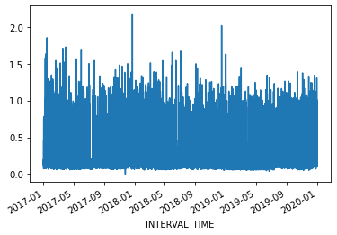
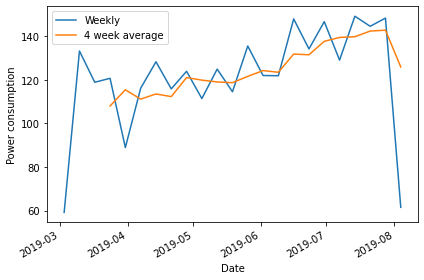
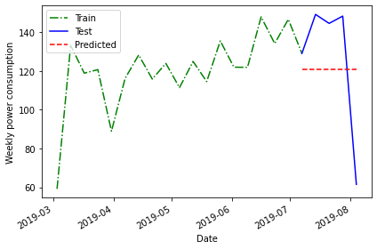
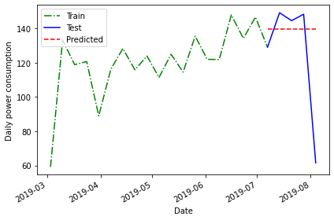

:::::::::::::::::::::::::::::::::::::: questions 

- What are some common baseline metrics for time-series forecasting?

::::::::::::::::::::::::::::::::::::::::::::::::

::::::::::::::::::::::::::::::::::::: objectives

- Identify baseline metrics for time-series forecasting.
- Evaluate performance of forecasting methods using plots and mean absolute
percentage error.

::::::::::::::::::::::::::::::::::::::::::::::::

## Introduction

In order to make reliable forecasts using time-series data, it is 
necessary to establish baseline forecasts against which to compare the
results of models that will be covered in later sections of this lesson.

In many cases, we can only predict one timestamp into the future. From the
standpoint of baseline metrics, there are multiple ways we can define a
timestep and base predictions using

- the historical mean across the dataset
- the value of the the previous timestep
- the last known value, or
- a naive seasonal baseline based upon a pairwise comparison of a set of 
previous timesteps.

## Create a data subset for basline forecasting

Rather than read a previously edited dataset, for each of the episodes in this
lesson we will read in data from one or more of the Los Alamos Department of
Public Utilities smart meter datasets downloaded in the 
[Setup]("https://carpentries-incubator.github.io/python-modeling-power-consumption/index.html")
 section. 
 
 Once the dataset has been read into memory, we will create a datetime index,
 subset, and resample the data for use in the rest of this episode.
 First, we need to import libraries.
 
 ```python
import pandas as pd
import numpy as np
import matplotlib.pyplot as plt
 ```
 
 Then we read the data and create the datetime index.
 
```python
df = pd.read_csv("../data/ladpu_smart_meter_data_10.csv")
print(df.info())
```

```output
<class 'pandas.core.frame.DataFrame'>
RangeIndex: 105012 entries, 0 to 105011
Data columns (total 5 columns):
 #   Column         Non-Null Count   Dtype  
---  ------         --------------   -----  
 0   INTERVAL_TIME  105012 non-null  object 
 1   METER_FID      105012 non-null  int64  
 2   START_READ     105012 non-null  float64
 3   END_READ       105012 non-null  float64
 4   INTERVAL_READ  105012 non-null  float64
dtypes: float64(3), int64(1), object(1)
memory usage: 4.0+ MB
```

```python
# Set datetime index
df.set_index(pd.to_datetime(df["INTERVAL_TIME"]), inplace=True)
df.sort_index(inplace=True)
print(df.info())
```
```output
<class 'pandas.core.frame.DataFrame'>
DatetimeIndex: 105012 entries, 2017-01-01 00:00:00 to 2019-12-31 23:45:00
Data columns (total 5 columns):
 #   Column         Non-Null Count   Dtype  
---  ------         --------------   -----  
 0   INTERVAL_TIME  105012 non-null  object 
 1   METER_FID      105012 non-null  int64  
 2   START_READ     105012 non-null  float64
 3   END_READ       105012 non-null  float64
 4   INTERVAL_READ  105012 non-null  float64
dtypes: float64(3), int64(1), object(1)
memory usage: 4.8+ MB
```

The dataset is large, with multiple types of seasonality occurring
including

- daily
- seasonal
- yearly

trends. Additionally, the data represent smart meter readings taken from a
single meter every fifteen minutes over the course of three years. This gives
us a dataset that consists of 105,012 rows of meter readings taken at a 
frequency which makes baseline forecasts less effective.



For our current purposes, we will subset the data to a period with fewer
seasonal trends. Using datetime indexing we can select a subset of the data
from the first six months of 2019.

```python
jan_june_2019 = df["2019-03": "2019-07"].copy()
```

We will also resample the data to a weekly frequency.

```python
weekly_usage = pd.DataFrame(jan_june_2019.resample("W")["INTERVAL_READ"].sum())
print(weekly_usage.info()) # note the index range and freq
print(weekly_usage.head())
```
```output
<class 'pandas.core.frame.DataFrame'>
DatetimeIndex: 23 entries, 2019-03-03 to 2019-08-04
Freq: W-SUN
Data columns (total 1 columns):
 #   Column         Non-Null Count  Dtype  
---  ------         --------------  -----  
 0   INTERVAL_READ  23 non-null     float64
dtypes: float64(1)
memory usage: 368.0 bytes
None
               INTERVAL_READ
INTERVAL_TIME               
2019-03-03           59.1300
2019-03-10          133.3134
2019-03-17          118.9374
2019-03-24          120.7536
2019-03-31           88.9320
```

Plotting the total weekly power consumption with a 4 week rolling mean
shows that there is still an overall trend and some apparent weekly seasonal
effects in the data. We will see how these different features of the data
influence different baseline forecasts.

```python
fig, ax = plt.subplots()

ax.plot(weekly_usage["INTERVAL_READ"], label="Weekly")
ax.plot(weekly_usage["INTERVAL_READ"].rolling(window=4).mean(), label="4 week average")

ax.set_xlabel('Date')
ax.set_ylabel('Power consumption')
ax.legend(loc=2)

fig.autofmt_xdate()
plt.tight_layout()
```



## Create subsets for training and testing forecasts

Throughout this lesson, as we develop more robust forecasting models we need
to train the models using a large subset of our data to derive the metrics
that define each type of forecast. Models are then evaluated by comparing
forecast values against actual values in a test dataset.

Using a rough estimate of four weeks in a month, we will test our baseline
forecasts using various methods to predict the last four weeks of power
consumption based on values in the test dataset. Then we will compare 
the forecast against the actual values in the test dataset.

```python
train = weekly_usage[:-4].copy()
test = weekly_usage[-5:].copy()

print(train.info())
print(test.info())
```

```output
<class 'pandas.core.frame.DataFrame'>
DatetimeIndex: 19 entries, 2019-03-03 to 2019-07-07
Freq: W-SUN
Data columns (total 1 columns):
 #   Column         Non-Null Count  Dtype  
---  ------         --------------  -----  
 0   INTERVAL_READ  19 non-null     float64
dtypes: float64(1)
memory usage: 304.0 bytes
None

<class 'pandas.core.frame.DataFrame'>
DatetimeIndex: 5 entries, 2019-07-07 to 2019-08-04
Freq: W-SUN
Data columns (total 1 columns):
 #   Column         Non-Null Count  Dtype  
---  ------         --------------  -----  
 0   INTERVAL_READ  5 non-null      float64
dtypes: float64(1)
memory usage: 80.0 bytes
None
```

## Forecast using the historical mean

The first baseline or *naive* forecast method we will use is the historical
mean. Here, we calculate the mean weekly power consumption across the
training dataset.

```python
# get the mean of the training set
historical_mean = np.mean(train['INTERVAL_READ'])
print("Historical mean of the training data:", historical_mean)
```

```output
Historical mean of the training data: 120.7503157894737
```
We then use this value as the value of the weekly forecast for all four
weeks of the test dataset.

```python
test.loc[:, 'pred_mean'] = historical_mean
```
Plotting the forecast shows that the same value has been applied to each 
week of the test dataset.

```python
fig, ax = plt.subplots()
 
ax.plot(train['INTERVAL_READ'], 'g-.', label='Train')
ax.plot(test['INTERVAL_READ'], 'b-', label='Test')
ax.plot(test['pred_mean'], 'r--', label='Predicted')
ax.set_xlabel('Date')
ax.set_ylabel('Weekly power consumption')
ax.legend(loc=2)

fig.autofmt_xdate()
plt.tight_layout()
```



The above plot is a qualitative method of evaluating the accuracy of the 
historical mean for forecasting our time series. Intuitively, we can see
that it is not very accurate. 

Quantitatively, we can evaluate the accuracy of the forecasts based on the 
*mean absolute percentage error*. We will be using this method to evaluate
all of our baseline forecasts, so we will define a function for it. 

The following is taken from Marco Peixeiro, *Time series forecasting in Python*:

> Peixeiro, Marco. Time Series Forecasting in Python. [First edition]. Manning Publications Co., 2022.

```python
# Mean absolute percentage error
# measure of prediction accuracy for forecasting methods

def mape(y_true, y_pred):
    return np.mean(np.abs((y_true - y_pred)/ y_true)) * 100
```

Now we can calculate the mean average percentage error of the historical
mean as a forecasting method.

```python
mape_hist_mean = mape(test['INTERVAL_READ'], test['pred_mean'])
print("MAPE of historical mean", mape_hist_mean)
```
```output
MAPE of historical mean: 31.44822521573767
```

The high mean average percentage error value suggests that, for these data, 
the historical mean is not an accurate forecasting method. 

## Forecast using the mean of the previous timestamp

One source of the error in forecasting with the historical mean can be the
amount of data, which over longer timeframes can introduce seasonal trends. As
an alternative to the historic mean, we can also forecast using the mean of
the previous timestep. Since we are forecasting power consumption over a period
of four weeks, this means we can use the mean power consumption within the
last four weeks of the training dataset as our forecast.

Since our data have been resampled to a weekly frequency, we will calculate
the average power consumption across the last four rows.

```python
# baseline using mean of last four weeks of training set

last_month_mean = np.mean(train['INTERVAL_READ'][-4:])
print("Mean of previous timestep:", last_month_mean)
```

```output
Mean of previous timestep: 139.55055000000002
```

Apply this to the test dataset. Selecting the data using the ```head()```
command shows that the value calculated above has been applied to each row.

```python
test.loc[:, 'pred_last_mo_mean'] =  last_month_mean
print(test.head())
```

```output
               INTERVAL_READ   pred_mean  pred_last_mo_mean
INTERVAL_TIME                                              
2019-07-07          129.1278  120.750316          139.55055
2019-07-14          149.2956  120.750316          139.55055
2019-07-21          144.6612  120.750316          139.55055
2019-07-28          148.4286  120.750316          139.55055
2019-08-04           61.4640  120.750316          139.55055
```

```python
fig, ax = plt.subplots()
 
ax.plot(train['INTERVAL_READ'], 'g-.', label='Train')
ax.plot(test['INTERVAL_READ'], 'b-', label='Test')
ax.plot(test['pred_last_mo_mean'], 'r--', label='Predicted')
ax.set_xlabel('Date')
ax.set_ylabel('Daily power consumption')
ax.legend(loc=2)

fig.autofmt_xdate()
plt.tight_layout()
```



Plotting the data suggests that this forecast may be more accurate than the
historical mean, but we will evaluate the forecast using the mean average
percentage error as well.

```python
mape_last_month_mean = mape(test['INTERVAL_READ'], test['pred_last_mo_mean'])
print("MAPE of the mean of the previous timestep forecast:", mape_last_month_mean)
```

```output
MAPE of the mean of the previous timestep forecast: 30.231515216486425
```

The result is a slight improvement over the previous method, but still not very
accurate.


::::::::::::::::::::::::::::::::::::: keypoints

- Use *test* and *train* datasets to evaluate the performance of different
models.
- Use *mean average percentage error* to measure a model's performance.

:::::::::::::::::::::::::::::::::::::::::::::::
