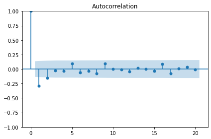
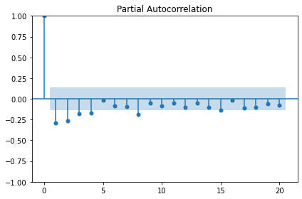
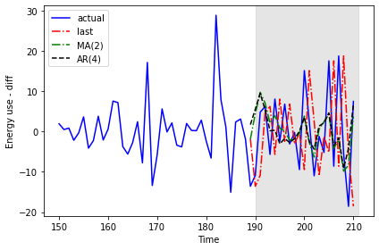
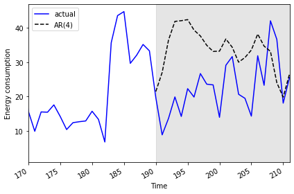

:::::::::::::::::::::::::::::::::::::: questions 

- How can we enhance our models to account for autoregression?

::::::::::::::::::::::::::::::::::::::::::::::::

::::::::::::::::::::::::::::::::::::: objectives

- Explain the parameters of *order* argument of the ```statsmodels``` SARIMAX
model.
- Refine forecasts to account for autoregressive processes.

::::::::::::::::::::::::::::::::::::::::::::::::

## Introduction

In this section we will continue to use the same subset of data to refine
our time-series forecasts. We have seen how we can improve forecasts by
differencing data so that time-series are stationary. 

However, as noted in our earlier results our forecasts are still not as 
accurate as we'd like them to be. This is because in addition to not being
stationary, our data include autoregressive processes. That is, values for
power consumption can be affected by previous values of the same variable.

## About the code

The code used in this lesson is based on and, in some cases, a direct 
application of code used in the Manning Publications title, *Time series forecasting in Python*, by Marco Peixeiro.

> Peixeiro, Marco. Time Series Forecasting in Python. [First edition]. Manning Publications Co., 2022.

The original code from the book is made available under an 
[Apache 2.0 license](https://github.com/marcopeix/TimeSeriesForecastingInPython/blob/master/LICENSE.txt). Use and application of the code in these materials is within
the license terms, although this lesson itself is licensed under a Creative Commons
[CC-BY 4.0 license](https://creativecommons.org/licenses/by/4.0/legalcode). Any
further use or adaptation of these materials should cite the source code
developed by Peixeiro:

> Peixeiro, Marco. Timeseries Forecasting in Python [Software code]. 2022.
Accessed from [https://github.com/marcopeix/TimeSeriesForecastingInPython](https://github.com/marcopeix/TimeSeriesForecastingInPython).


## Create data subset

Since we have been using the same process to read and subset a single data file,
this time we will write a function that includes the necessary commands. This
will make our process more flexible in case we want to change the date range
or the resampling frequency and test our models on different subsets.

First we need to import the same libraries as before.

```python
import pandas as pd
import numpy as np
import matplotlib.pyplot as plt
from statsmodels.tsa.stattools import adfuller
from statsmodels.graphics.tsaplots import plot_acf
from statsmodels.graphics.tsaplots import plot_pacf
from statsmodels.tsa.statespace.sarimax import SARIMAX
from sklearn.metrics import mean_squared_error
from sklearn.metrics import mean_absolute_error
```

Now, define a function that takes the name of a data file, a start and end date
for a date range, and a resampling frequency as arguments.

```python
def subset_resample(fpath, sample_freq, start_date, end_date=None):
    df = pd.read_csv(fpath)
    df.set_index(pd.to_datetime(df["INTERVAL_TIME"]), inplace=True)
    df.sort_index(inplace=True)
    if end_date:
        date_subset = df.loc[start_date: end_date].copy()
    else:
        date_subset = df.loc[start_date].copy()
    resampled_data = date_subset.resample(sample_freq)
    return resampled_data
```

Note that the returned object is not a data frame - it's a 
*DatetimeIndexResampler*, which is a kind of group in Pandas.

```python
fp = "../../data/ladpu_smart_meter_data_01.csv"
data_subset_resampled = subset_resample(fp, "D", "2019-01", end_date="2019-07")
print("Data type of returned object:", type(data_subset_resampled))
```

We can create a dataframe for forecasting by aggregating the data using a
specific metric. In this case, we will use the sum of the daily
"INTERVAL_READ" values.

```python
daily_usage = data_subset_resampled['INTERVAL_READ'].agg([np.sum])
print(daily_usage.info())
print(daily_usage.head())
```

```output
<class 'pandas.core.frame.DataFrame'>
DatetimeIndex: 212 entries, 2019-01-01 to 2019-07-31
Freq: D
Data columns (total 1 columns):
 #   Column  Non-Null Count  Dtype  
---  ------  --------------  -----  
 0   sum     212 non-null    float64
dtypes: float64(1)
memory usage: 3.3 KB
None
                   sum
INTERVAL_TIME         
2019-01-01      7.5324
2019-01-02     10.2534
2019-01-03      6.8544
2019-01-04      5.3250
2019-01-05      7.5480
```

We can further inspect the data by plotting.

```python
fig, ax = plt.subplots()

ax.plot(daily_usage['sum'])
ax.set_xlabel('Time')
ax.set_ylabel('Daily electricity consumption')

fig.autofmt_xdate()
plt.tight_layout()
```


## Determine order of autoregressive process

As before, we will also calculate the AD Fuller statistic on the data. 

```python
adfuller_test = adfuller(daily_usage)
print(f'ADFuller result: {adfuller_test[0]}')
print(f'p-value: {adfuller_test[1]}') 
```
```output
ADFuller result: -2.533089941397639
p-value: 0.10762933815081588
```

The result indicates that the data are not stationary, so we will difference
the data and recalculate the AD Fuller statistic.

```python
daily_usage_diff = np.diff(daily_usage['sum'], n = 1)
adfuller_test = adfuller(daily_usage_diff)     
print(f'ADFuller result: {adfuller_test[0]}')
print(f'p-value: {adfuller_test[1]}') 
```

```output
ADFuller result: -7.966077912452976
p-value: 2.8626643210939594e-12
```

Plotting the autocorrelation function suggests an autoregressive process
occurring within the data.

```python
plot_acf(daily_usage_diff, lags=20);
plt.tight_layout()
```



The *order* argument of the SARIMAX model that we are using for our forecasts
includes a parameter for specifying the order of the autoregressive process. 
We can plot the partial autocorrelation function to determine this.

```python
plot_pacf(daily_usage_diff, lags=20);
plt.tight_layout()
```



The plot indicates significant autoregression up to the fourth lag, so we
have an autoregressive process of order 4, or AR(4).

## Forecast an autoregressive process

With the order of the autoregressive process known, we can revise our
forecasting function to pass this new parameter to the SARIMAX model from
```sklearn```.

First, we will create training and test datasets and plot to show the range of
values we will forecast.

```python
df_diff = pd.DataFrame({'daily_usage': daily_usage_diff})   
 
train = df_diff[:int(len(df_diff) * .9)] # ~90% of data
test = df_diff[int(len(df_diff) * .9):] # ~10% of data        
print("Training data length:", len(train))
print("Test data length:", len(test))
```

```output
Training data length: 189
Test data length: 22
```

And the plot:

```python
fig, (ax1, ax2) = plt.subplots(nrows=2, ncols=1, sharex=True, 
                               figsize=(10, 8))                   
 
ax1.plot(daily_usage['sum'].values)
ax1.set_xlabel('Time')
ax1.set_ylabel('Energy use')
ax1.axvspan(190, 211, color='#808080', alpha=0.2)
 
ax2.plot(df_diff['daily_usage'])
ax2.set_xlabel('Time')
ax2.set_ylabel('Energy use - diff')
ax2.axvspan(190, 211, color='#808080', alpha=0.2)

fig.autofmt_xdate()
plt.tight_layout()
```


We are also going to update our function from the previous section, in which
we hard-coded a value for the order of the autoregressive process in the 
*order* argument of the SARIMAX model. Here we generalize the function name
to ```model_forecast()``` and we are now using arguments, *ar_order* and 
*ma_order*, to pass two of the three parameters required by the *order*
argument of the model.

As before, we will use the last known value as our baseline metric for 
evaluating the performance of the updated model. 


```python
def last_known(data, training_len, horizon, window):
    total_len = training_len + horizon
    pred_last_known = []
    
    for i in range(training_len, total_len, window):
        subset = data[:i]
        last_known = subset.iloc[-1].values[0]
        pred_last_known.extend(last_known for v in range(window))
    
    return pred_last_known

def model_forecast(data, training_len, horizon, ar_order, ma_order, window):
    total_len = training_len + horizon
    model_predictions = []
    
    for i in range(training_len, total_len, window):
        model = SARIMAX(data[:i], order=(ar_order, 0, ma_order)) 
        res = model.fit(disp=False)
        predictions = res.get_prediction(0, i + window - 1)
        oos_pred = predictions.predicted_mean.iloc[-window:]
        model_predictions.extend(oos_pred)
        
    return model_predictions
```

Now we can call our functions to forecast power consumption. For comparison
sake we will also make a prediction using the moving average forecast from
the last section. Recall that the order of the moving average process was 2,
and the order of the autoregressive process is 4. 

```python
TRAIN_LEN = len(train)                      
HORIZON = len(test)                         
WINDOW = 1                              
 
pred_last_value = last_known(df_diff, TRAIN_LEN, HORIZON, WINDOW)    
pred_MA = model_forecast(df_diff, TRAIN_LEN, HORIZON, 0, 2, WINDOW)
pred_AR = model_forecast(df_diff, TRAIN_LEN, HORIZON, 4, 0, WINDOW)
                
test['pred_last_value'] = pred_last_value 
test['pred_MA'] = pred_MA 
test['pred_AR'] = pred_AR                   
 
print(test.head())
```

```output
     daily_usage  pred_last_value   pred_MA   pred_AR
189     -13.5792          -1.8630 -1.870535  1.735114
190     -10.8660         -13.5792  4.425102  5.553305
191       4.8054         -10.8660  9.760944  9.475778
192       6.2280           4.8054  7.080340  5.395541
193      -5.6718           6.2280  2.106354  0.205880
```

Plotting the result shows that the results of the moving average and
autoregressive forecasts are very similar.

```python
fig, ax = plt.subplots()
                      
ax.plot(df_diff[150:]['daily_usage'], 'b-', label='actual')                                         
ax.plot(test['pred_last_value'], 'r-.', label='last') 
ax.plot(test['pred_MA'], 'g-.', label='MA(2)')    
ax.plot(test['pred_AR'], 'k--', label='AR(4)')          
 
ax.axvspan(190, 211, color='#808080', alpha=0.2)         
ax.legend(loc=2)                                         
 
ax.set_xlabel('Time')
ax.set_ylabel('Energy use - diff')

plt.tight_layout()
```



Calculating the mean squared error for each forecast indicates that of the
three forecasting methods, the moving average performs the best.

```python
mse_last = mean_squared_error(test['daily_usage'], test['pred_last_value'])
mse_MA = mean_squared_error(test['daily_usage'], test['pred_MA'])
mse_AR = mean_squared_error(test['daily_usage'], test['pred_AR'])
 
print("MSE of last known value forecast:", mse_last)
print("MSE of MA(2) forecast:",mse_MA)
print("MSE of AR(4) forecast:",mse_AR)
```

```output
MSE of last known value forecast: 252.6110739163637
MSE of MA(2) forecast: 73.404918547051
MSE of AR(4) forecast: 85.29189129936279
```

Given the choice between these three results, we would apply the moving
average forecast to our data. For the purposes of demonstration, however,
we will reverse transform our differenced data with the autoregressive
forecast results.

```python
daily_usage['pred_usage'] = pd.Series() 
daily_usage['pred_usage'][190:] = daily_usage['sum'].iloc[190] + test['pred_AR'].cumsum()
print(daily_usage.tail()) 
```

```output
                   sum  pred_usage
INTERVAL_TIME                     
2019-07-27     23.2752   34.683237
2019-07-28     42.0504   33.145726
2019-07-29     36.6444   24.039123
2019-07-30     18.0828   19.823836
2019-07-31     25.5774   26.623576
```

Finally we can plot the transformed forecasts with the actual power
consumption values for comparison, and perform a final evaluation using the
mean absolute error. As expected from the results of the mean squared error
calculated above, the mean absolute error for the autoregressive forecast
will be higher than that reported for the moving average forecast
in the previous section.

```python
mae_MA_undiff = mean_absolute_error(daily_usage['sum'].iloc[191:], 
                                    daily_usage['pred_usage'].iloc[191:])
 
print("Mean absolute error, AR(4):", mae_MA_undiff)
```

```output
Mean absolute error, AR(4): 13.074409772576958
```

Plot code:

```python
fig, ax = plt.subplots()
 
ax.plot(daily_usage['sum'].values, 'b-', label='actual') 
ax.plot(daily_usage['pred_usage'].values, 'k--', label='AR(4)') 
 
ax.legend(loc=2)
 
ax.set_xlabel('Time')
ax.set_ylabel('Energy consumption')
ax.axvspan(190, 211, color='#808080', alpha=0.2)
ax.set_xlim(170, 211)
 
fig.autofmt_xdate()
plt.tight_layout()
```



::::::::::::::::::::::::::::::::::::: keypoints 

- The *order* argument of the SARIMAX model includes parameters for the order
of autoregressive and moving average processes.

::::::::::::::::::::::::::::::::::::::::::::::::

