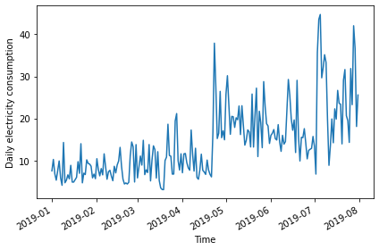
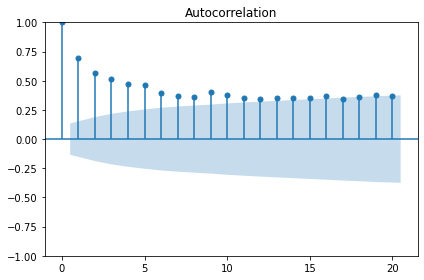
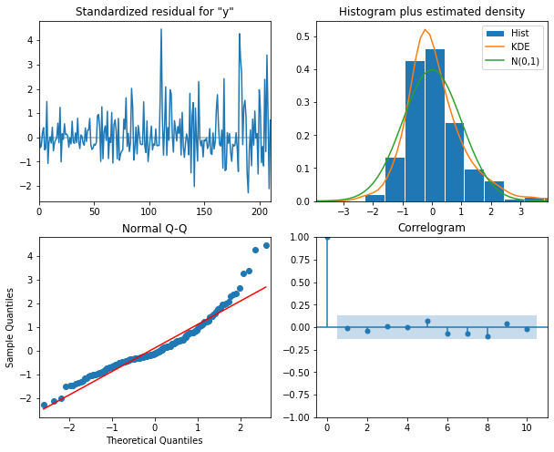
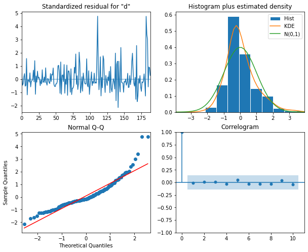
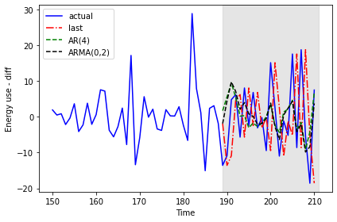

:::::::::::::::::::::::::::::::::::::: questions 

- How can we forecast time-series with both moving average and autoregressive
processes?

::::::::::::::::::::::::::::::::::::::::::::::::

::::::::::::::::::::::::::::::::::::: objectives

- Apply a generalized workflow to fit different models.

::::::::::::::::::::::::::::::::::::::::::::::::

## Introduction

Further refining process to combine parameters of order of processes.

## About the code

The code used in this lesson is based on and, in some cases, a direct 
application of code used in the Manning Publications title, *Time series forecasting in Python*, by Marco Peixeiro.

> Peixeiro, Marco. Time Series Forecasting in Python. [First edition]. Manning Publications Co., 2022.

The original code from the book is made available under an 
[Apache 2.0 license](https://github.com/marcopeix/TimeSeriesForecastingInPython/blob/master/LICENSE.txt). Use and application of the code in these materials is within
the license terms, although this lesson itself is licensed under a Creative Commons
[CC-BY 4.0 license](https://creativecommons.org/licenses/by/4.0/legalcode). Any
further use or adaptation of these materials should cite the source code
developed by Peixeiro:

> Peixeiro, Marco. Timeseries Forecasting in Python [Software code]. 2022.
Accessed from [https://github.com/marcopeix/TimeSeriesForecastingInPython](https://github.com/marcopeix/TimeSeriesForecastingInPython).

## Read and subset data

Import libraries.

```python
import pandas as pd
import numpy as np
import matplotlib.pyplot as plt
from statsmodels.tsa.stattools import adfuller
from statsmodels.graphics.tsaplots import plot_acf
from statsmodels.graphics.tsaplots import plot_pacf
from statsmodels.tsa.statespace.sarimax import SARIMAX
from sklearn.metrics import mean_squared_error
from sklearn.metrics import mean_absolute_error
```

Reuse our function to read, subset, and resample data.

```python
def subset_resample(fpath, sample_freq, start_date, end_date=None):
    df = pd.read_csv(fpath)
    df.set_index(pd.to_datetime(df["INTERVAL_TIME"]), inplace=True)
    df.sort_index(inplace=True)
    if end_date:
        date_subset = df.loc[start_date: end_date].copy()
    else:
        date_subset = df.loc[start_date].copy()
    resampled_data = date_subset.resample(sample_freq)
    return resampled_data
```

Call the function.

```python
fp = "../../data/ladpu_smart_meter_data_01.csv"
data_subset_resampled = subset_resample(fp, "D", "2019-01", end_date="2019-07")
print("Data type of returned object:", type(data_subset_resampled))
```

```output
Data type of returned object: <class 'pandas.core.resample.DatetimeIndexResampler'>
```

Create a dataframe and inspect.

```python
daily_usage = data_subset_resampled['INTERVAL_READ'].agg([np.sum])
print(daily_usage.info())
print(daily_usage.head())
```

```output
<class 'pandas.core.frame.DataFrame'>
DatetimeIndex: 212 entries, 2019-01-01 to 2019-07-31
Freq: D
Data columns (total 1 columns):
 #   Column  Non-Null Count  Dtype  
---  ------  --------------  -----  
 0   sum     212 non-null    float64
dtypes: float64(1)
memory usage: 3.3 KB
None
                   sum
INTERVAL_TIME         
2019-01-01      7.5324
2019-01-02     10.2534
2019-01-03      6.8544
2019-01-04      5.3250
2019-01-05      7.5480
```

Plot.

```python
fig, ax = plt.subplots()

ax.plot(daily_usage['sum'])
ax.set_xlabel('Time')
ax.set_ylabel('Daily electricity consumption')

fig.autofmt_xdate()
plt.tight_layout()
```



AD Fuller test.

```python
adfuller_test = adfuller(daily_usage)
print(f'ADFuller result: {adfuller_test[0]}')
print(f'p-value: {adfuller_test[1]}')   
```

```output
ADFuller result: -2.533089941397639
p-value: 0.10762933815081588
```

Difference data.

```python
daily_usage_diff = np.diff(daily_usage['sum'], n = 1)
adfuller_test = adfuller(daily_usage_diff)     
print(f'ADFuller result: {adfuller_test[0]}')
print(f'p-value: {adfuller_test[1]}') 
```

```output
ADFuller result: -7.966077912452976
p-value: 2.8626643210939594e-12
```

Plot ACF

```python
plot_acf(daily_usage, lags=20);
plt.tight_layout()
```



## Determine the orders of the ARMA(p, q) processes

Plot indicates an autoregressive process.

The order of an autoregressive moving average, or ARMA, process, may not be
intelligible from a PACF plot. For the remainder of this lesson, rather than
determine order by visually inspecting plots we will statistically 
determine order of AR and MA processes using a generalized procedure.

We will fit multiple models with different values for the order of the AR and
MA processes and evaluate each one by the resulting Akaike information
criterion (AIC) value. The AIC is an attribute of a SARIMAX model, so we will 
continue to refine our function for interacting with the SARIMAX model of the
```statsmodel``` library.

First we create a list of possible values of the orders of the AR and MA
processes. In the code below and in general use, the order of the AR process
is given as *p*, while the order of the MA process is given as *q*.

```python
from itertools import product

p_vals = range(0, 4, 1)                  
q_vals = range(0, 4, 1)                  
 
order_list = list(product(p_vals, q_vals))

for o in order_list:
    print(o)
```

```output
(0, 0)
(0, 1)
(0, 2)
(0, 3)
(1, 0)
(1, 1)
(1, 2)
(1, 3)
(2, 0)
(2, 1)
(2, 2)
(2, 3)
(3, 0)
(3, 1)
(3, 2)
(3, 3)
```

The output above demonstrates the combinations of AR(p) and MA(q) values
we will be using to fit, in this case, 16 different ARMA(p, q) models. We
will compare the AIC of the results and select the best performing model.

Since we're not forecasting yet, we will write a new function to fit and
evaluate our 16 models.

```python
def fit_eval_AIC(data, order_list):
    aic_results = []
    for o in order_list:
        model = SARIMAX(data, order=(o[0], 0, o[1]),
                        simple_differencing=False)
        res = model.fit(disp=False)
        aic = res.aic
        aic_results.append([o, aic])
        
    result_df = pd.DataFrame(aic_results, columns=(['(p, q)', 'AIC']))
    result_df.sort_values(by='AIC', ascending=True, inplace=True)
    result_df.reset_index(drop=True, inplace=True)
    
    return result_df
```

The function will return a dataframe of ARMA(p, q) combinations and their 
corresponding AIC values. Results have been sorted by ascending AIC values since
a lower AIC value is better. Generally, the top performing model will be 
listed first.

```python
result_df = fit_eval_AIC(daily_usage_diff, order_list)    
print(result_df)
```

```output
    (p, q)          AIC
0   (1, 1)  1338.285936
1   (1, 2)  1340.280751
2   (2, 1)  1340.281961
3   (2, 2)  1341.021637
4   (0, 2)  1341.239402
5   (0, 3)  1341.295724
6   (3, 1)  1341.845466
7   (2, 3)  1342.689150
8   (3, 2)  1342.699834
9   (3, 3)  1342.905525
10  (1, 3)  1344.861937
11  (0, 1)  1356.044366
12  (3, 0)  1358.323315
13  (2, 0)  1363.368153
14  (1, 0)  1375.855521
15  (0, 0)  1391.965311
```

The result indicates that the best performing model among the 16 is the 
ARMA(1, 1) model. But in a worst case this could simply mean that the 
ARMA(1, 1) model is the least bad out of the models we fitted. We also want to
assess its overall quality. Before using the model to forecast, it's also
perform diagnostics to make sure the model doesn't violate any of its
underlying assumptions. We can use ```plot_diagnostics()``` to evaluate the
distribution of residuals of the ARMA(1, 1) model.

```python
model = SARIMAX(daily_usage_diff, order=(1,0,1), simple_differencing=False)
model_fit = model.fit(disp=False)
model_fit.plot_diagnostics(figsize=(10, 8));
```

The plots indicate that there is some room for improvement. We will see this
improvement in a later section of this lesson when we finally account for the
seasonal trends evident in the data. But for now we will proceed and show that
the ARMA(p, q) process nonetheless represent a significant improvement over 
forecasting with either the AR(p) or MA(q) processes by themselves.



## Forecast using an ARMA(p, q) model

In the previous section we already updated our forecasting function to
initialize a SARIMAX model using variables for the AR(p) and MA(q) orders in
the *order* argument. We can reuse the same function here.

```python
def last_known(data, training_len, horizon, window):
    total_len = training_len + horizon
    pred_last_known = []
    
    for i in range(training_len, total_len, window):
        subset = data[:i]
        last_known = subset.iloc[-1].values[0]
        pred_last_known.extend(last_known for v in range(window))
    
    return pred_last_known

def model_forecast(data, training_len, horizon, ar_order, ma_order, window):
    total_len = training_len + horizon
    model_predictions = []
    
    for i in range(training_len, total_len, window):
        model = SARIMAX(data[:i], order=(ar_order, 0, ma_order)) 
        res = model.fit(disp=False)
        predictions = res.get_prediction(0, i + window - 1)
        oos_pred = predictions.predicted_mean.iloc[-window:]
        model_predictions.extend(oos_pred)
        
    return model_predictions
```

Next we create our training and test datasets and plot the differenced data
with the original data. As before, the forecast range is shaded.

```python
df_diff = pd.DataFrame({'daily_usage': daily_usage_diff})   
 
train = df_diff[:int(len(df_diff) * .9)] # ~90% of data
test = df_diff[int(len(df_diff) * .9):] # ~10% of data        
print("Training data length:", len(train))
print("Test data length:", len(test))
```

```output
Training data length: 189
Test data length: 22
```

Plot code:

```python
fig, (ax1, ax2) = plt.subplots(nrows=2, ncols=1, sharex=True, 
                               figsize=(10, 8))                   
 
ax1.plot(daily_usage['sum'].values)
ax1.set_xlabel('Time')
ax1.set_ylabel('Energy use')
ax1.axvspan(190, 211, color='#808080', alpha=0.2)
 
ax2.plot(df_diff['daily_usage'])
ax2.set_xlabel('Time')
ax2.set_ylabel('Energy use - diff')
ax2.axvspan(190, 211, color='#808080', alpha=0.2)

fig.autofmt_xdate()
plt.tight_layout()
```


Before proceeding, we want to re-evaluate our list of ARMA(p, q) combinations
against the training dataset. We will re-use the ```order_list``` from above.

It's a good thing we did so - note that the best performing model in this case
is an ARMA(0, 2).

```python
result_df = fit_eval_AIC(train['daily_usage'], order_list)
print(result_df)
```

```output
    (p, q)          AIC
0   (0, 2)  1174.311541
1   (1, 1)  1174.622990
2   (1, 2)  1176.276602
3   (0, 3)  1176.293394
4   (2, 1)  1176.474520
5   (2, 2)  1176.928701
6   (3, 1)  1177.165924
7   (1, 3)  1177.484128
8   (2, 3)  1178.444434
9   (3, 2)  1178.809561
10  (3, 3)  1179.559015
11  (0, 1)  1182.375097
12  (3, 0)  1185.092321
13  (2, 0)  1188.277358
14  (1, 0)  1201.973433
15  (0, 0)  1215.699746
```

Before forecasting, we also want to check that no assumptions of the model
are violated by plotting diagnostics of the residuals.

```python
model = SARIMAX(train['daily_usage'], order=(0,0,2), simple_differencing=False)
model_fit = model.fit(disp=False)
model_fit.plot_diagnostics(figsize=(10, 8));
```



Finally, we will forecast and evaluate the results against our previously
used baseline of the last known forecast. We will also compare the ARMA(0, 2)
forecast with results from our previous AR(4) and MA(2) forecasts. 

As we can see by the function call, an ARMA(0, 2) is equivalent to an MA(2) 
process. We expect the results from these models to be the same.

```python
TRAIN_LEN = len(train)                      
HORIZON = len(test)                         
WINDOW = 1                              
 
pred_last_value = last_known(df_diff, TRAIN_LEN, HORIZON, WINDOW)    
pred_MA = model_forecast(df_diff, TRAIN_LEN, HORIZON, 0, 2, WINDOW)
pred_AR = model_forecast(df_diff, TRAIN_LEN, HORIZON, 4, 0, WINDOW)
pred_ARMA = model_forecast(df_diff, TRAIN_LEN, HORIZON, 0, 2, WINDOW)
                
test['pred_last_value'] = pred_last_value 
test['pred_MA'] = pred_MA
test['pred_AR'] = pred_AR 
test['pred_ARMA'] = pred_ARMA               
 
print(test.head())
```

```output
     daily_usage  pred_last_value   pred_MA   pred_AR  pred_ARMA
189     -13.5792          -1.8630 -1.870535  1.735114  -1.870535
190     -10.8660         -13.5792  4.425102  5.553305   4.425102
191       4.8054         -10.8660  9.760944  9.475778   9.760944
192       6.2280           4.8054  7.080340  5.395541   7.080340
193      -5.6718           6.2280  2.106354  0.205880   2.106354
```

Indeed, we can see the results for the "pred_MA" and "pred_ARMA" forecasts are
the same. While that may seem underwhelming, it's important to note that in 
this case our model was determined using a statistical approach to fitting
multiple models, whereas previously we manually counted significant lags in an
ACF plot. This approach is much more scalable.

Since the results are the same, we will only refer to the "pred_ARMA" results
from here on when comparing against the baseline and the "pred_AR" results.

The plot indicates that the forecasts of the AR(4) model and the ARMA(0,2) model
are very similar. 

```python
fig, ax = plt.subplots()
                      
ax.plot(df_diff[150:]['daily_usage'], 'b-', label='actual')                                        
ax.plot(test['pred_last_value'], 'r-.', label='last')  
ax.plot(test['pred_AR'], 'g--', label='AR(4)')     
ax.plot(test['pred_ARMA'], 'k--', label='ARMA(0,2)')          
 
ax.axvspan(189, 211, color='#808080', alpha=0.2)         
ax.legend(loc=2)                                         
 
ax.set_xlabel('Time')
ax.set_ylabel('Energy use - diff')

plt.tight_layout()
```




The mean squared error shows a meaningful improvement from the results of the
AR(4) model in the previous section.

```python
mse_last = mean_squared_error(test['daily_usage'], test['pred_last_value'])
mse_AR = mean_squared_error(test['daily_usage'], test['pred_AR'])
mse_ARMA = mean_squared_error(test['daily_usage'], test['pred_ARMA'])
 
print("MSE of last known value forecast:", mse_last)
print("MSE of AR(4) forecast:",mse_AR)
print("MSE of ARMA(0, 2) forecast:",mse_ARMA)
```

```output
MSE of last known value forecast: 252.6110739163637
MSE of AR(4) forecast: 85.29189129936279
MSE of ARMA(0, 2) forecast: 73.404918547051
```


::::::::::::::::::::::::::::::::::::: keypoints 

- The Akaike information criterion (AIC) is an attribute of a SARIMAX model
that can be used to compare model results using different ARMA(p, q) 
parameters.

::::::::::::::::::::::::::::::::::::::::::::::::

