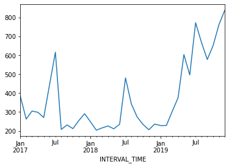
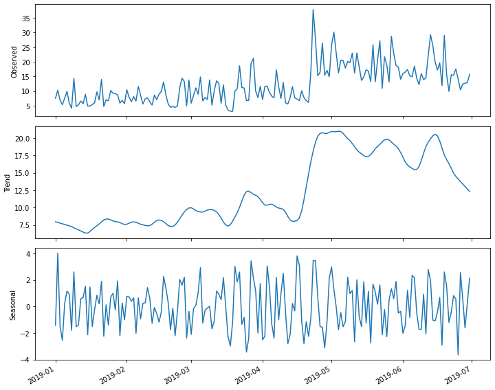
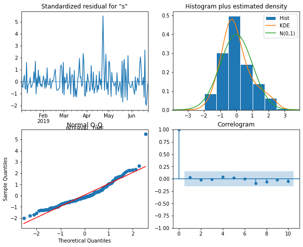
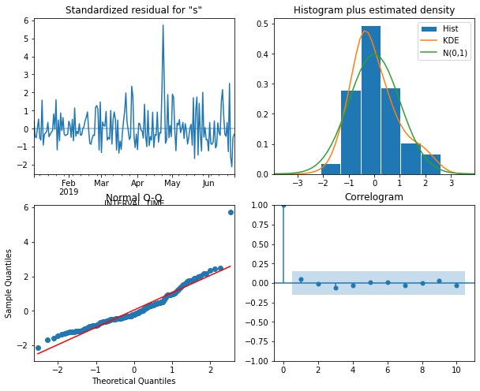
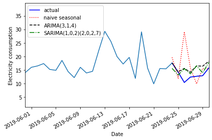

:::::::::::::::::::::::::::::::::::::: questions 

- How do we account for seasonal processes in time-series forecasting?
::::::::::::::::::::::::::::::::::::::::::::::::


::::::::::::::::::::::::::::::::::::: objectives

- Explain the SARIMA(p,d, q)(P, D, Q)m model.

::::::::::::::::::::::::::::::::::::::::::::::::

## Introduction

The data we have been using so far have apparent seasonal trends. That is, in
addition to trends across the entire dataset, there are periodic trends. We can
see this most clearly if we look at a plot of monthly power consumption from a
single meter over three years, 2017-2019.

```python
d = pd.read_csv("../../data/ladpu_smart_meter_data_01.csv")
d.set_index(pd.to_datetime(d["INTERVAL_TIME"]), inplace=True)
d.sort_index(inplace=True)
d.resample("M")["INTERVAL_READ"].sum().plot()
```



The above plot shows an overall trend of decreased power usage between 2017 and 
2018, with a significant increase in power usage in 2019. What may stand out
more prominently, however, are the seasonal trends in the data. In particular,
there are annual peaks in power consumption in the summer, with smaller peaks
in the winter. Power consumption in spring and fall is comparatively low.

Though our example here is explicitly seasonal, *seasonal* trends can be 
any periodic trend, including monthly, weekly, or daily trends. In fact,
it is possible for a time-series to exhibit multiple trends. This is true of
our data. Consider your own power consumption at home, where periodic trends
can include

- Daily trends where power consumption may be greater in the morning and 
evening, before and after work and before sleep.
- Weekly trends where power consumption may be greater over the weekend, or
outside of whatever your normal work hours may be.

In this episode, we will expand our model to account for periodic or seasonal
trends in the time-series.

## About the code

The code used in this lesson is based on and, in some cases, a direct 
application of code used in the Manning Publications title, *Time series forecasting in Python*, by Marco Peixeiro.

> Peixeiro, Marco. Time Series Forecasting in Python. [First edition]. Manning Publications Co., 2022.

The original code from the book is made available under an 
[Apache 2.0 license](https://github.com/marcopeix/TimeSeriesForecastingInPython/blob/master/LICENSE.txt). Use and application of the code in these materials is within
the license terms, although this lesson itself is licensed under a Creative Commons
[CC-BY 4.0 license](https://creativecommons.org/licenses/by/4.0/legalcode). Any
further use or adaptation of these materials should cite the source code
developed by Peixeiro:

> Peixeiro, Marco. Timeseries Forecasting in Python [Software code]. 2022.
Accessed from [https://github.com/marcopeix/TimeSeriesForecastingInPython](https://github.com/marcopeix/TimeSeriesForecastingInPython).

## Create the data subset

For this episode, we return to the data subset we've used for all but the 
last episode, with the difference that we will limit the date range of the 
subset to January - June, 2019.

First, load the necessary libaries and define the function to read, subset, and
resample the data.

```python
from sklearn.metrics import mean_squared_error, mean_absolute_error
from statsmodels.tsa.seasonal import STL
from statsmodels.stats.diagnostic import acorr_ljungbox
from statsmodels.tsa.statespace.sarimax import SARIMAX
from statsmodels.tsa.stattools import adfuller
from tqdm import tqdm_notebook
from itertools import product
from typing import Union

import matplotlib.pyplot as plt
import numpy as np
import pandas as pd
```

```python
def subset_resample(fpath, sample_freq, start_date, end_date=None):
    df = pd.read_csv(fpath)
    df.set_index(pd.to_datetime(df["INTERVAL_TIME"]), inplace=True)
    df.sort_index(inplace=True)
    if end_date:
        date_subset = df.loc[start_date: end_date].copy()
    else:
        date_subset = df.loc[start_date].copy()
    resampled_data = date_subset.resample(sample_freq)
    return resampled_data
```


Call our function to read and subset the data.

```python
fp = "../../data/ladpu_smart_meter_data_01.csv"
data_subset_resampled = subset_resample(fp, "D", "2019-01", end_date="2019-06")
print("Data type of returned object:", type(data_subset_resampled))
```

```output
Data type of returned object: <class 'pandas.core.resample.DatetimeIndexResampler'>
```

As before, we will aggregate the data to daily total power consumption. We
will use these daily totals to explore and make predictions based on weekly
trends.

```python
daily_usage = data_subset_resampled['INTERVAL_READ'].agg([np.sum])
print(daily_usage.info())
print(daily_usage.head())
```

```output
<class 'pandas.core.frame.DataFrame'>
DatetimeIndex: 181 entries, 2019-01-01 to 2019-06-30
Freq: D
Data columns (total 1 columns):
 #   Column  Non-Null Count  Dtype  
---  ------  --------------  -----  
 0   sum     181 non-null    float64
dtypes: float64(1)
memory usage: 2.8 KB
None
                   sum
INTERVAL_TIME         
2019-01-01      7.5324
2019-01-02     10.2534
2019-01-03      6.8544
2019-01-04      5.3250
2019-01-05      7.5480
```

This time, instead of plotting the daily total power consumption we will use
the ```statsmodels``` ```STL``` method to create a decomposition plot of the
time-series. The decomposition plot is actually a figure that includes three
subplots, one for the observed values, which is essentially the plot we have
been rendering in the other sections of this lesson when we first inspect the
data.

The other two plots include the overall trend and the seasonal trends. Because
we set the *period* argument to 7 when we created the figure, the returned
*Seasonal* subplot is represented as a series of 7 day intervals. A weekly
trends is evident.

```python
decomposition = STL(daily_usage['sum'], period=7).fit()      
 
fig, (ax1, ax2, ax3) = plt.subplots(nrows=3, ncols=1, 
                                    sharex=True, figsize=(10,8))                                          
 
ax1.plot(decomposition.observed)
ax1.set_ylabel('Observed')
 
ax2.plot(decomposition.trend)
ax2.set_ylabel('Trend')
 
ax3.plot(decomposition.seasonal)
ax3.set_ylabel('Seasonal')
 
fig.autofmt_xdate()
plt.tight_layout()
```




## Determine orders of SARIMA(p, d, q)(P, D, Q)m processes

The parameters of the seasonal autoregressive integrated moving average
model are similar to those of the ARIMA(p, d, q) model covered in the
previous section. The difference is that in addition to specifying the orders
of the ARIMA(p, d, q) processes, we are additionally specifying the same
parameters, here represented as *(P, D, Q)* over a given period, *m*.

We can use differencing to determine the integration order, *d*, and the
seasonal integration order, *D*.

As we have seen, our time-series is non-stationary. 

```python
ADF_result = adfuller(daily_usage['sum'])     
print(f'ADF Statistic: {ADF_result[0]}')      
print(f'p-value: {ADF_result[1]}')
```

```output
ADF Statistic: -2.4711247025051346
p-value: 0.1226589853651796
```

First order differencing results in a stationary time-series.

```python
daily_usage_diff = np.diff(daily_usage['sum'], n = 1)
ADF_result = adfuller(daily_usage_diff)     
print(f'ADF Statistic: {ADF_result[0]}')      
print(f'p-value: {ADF_result[1]}')
```

```output
ADF Statistic: -7.608254715996063
p-value: 2.291404555919546e-11
```

From this we know that the value of the integration order is 1. Since we are
interested in a weekly period, we will use a value of 7 for *m* in the
SARIMA(p, d, q)(P, D, Q)m model. In the SARIMAX model, this value is given
as *s*, which is the fourth parameter of the *seasonal_order* argument.

We will update our AIC function to incorporate these additional arguments.
Note that we have not yet determined the seasonal integration order, *D*.

```python
def fit_eval_AIC(data, order_list, d, D, s):
    aic_results = []
    for o in order_list:
        model = SARIMAX(data, order=(o[0], d, o[1]),
                        seasonal_order = (o[2], D, o[3], s),
                        simple_differencing=False)
        res = model.fit(disp=False)
        aic = res.aic
        aic_results.append([o, aic])
        
    result_df = pd.DataFrame(aic_results, columns=(['(p, q, P, Q)', 'AIC']))
    result_df.sort_values(by='AIC', ascending=True, inplace=True)
    result_df.reset_index(drop=True, inplace=True)
    
    return result_df
```

Using the definition of a SARIMA(p, d, q)(P, D, Q)m model, we note that when
the seasonal (P, D, Q) orders are zero, that is equivalent to an ARIMA(p, d, q)
model, with the addition of a specified period *m*. Recall that the period
parameter in the SARIMAX model is given as *s*. With this in mind we can use 
the function to fit and evaluate a range of possible ARMA(p, q) orders as
before. 

```python
ps = range(0, 8, 1)                               
qs = range(0, 8, 1)    
Ps = [0]                                           
Qs = [0]    

d = 1                                            
D = 0                                              
s = 7                                             
 
ARIMA_order_list = list(product(ps, qs, Ps, Qs))
print(ARIMA_order_list)

```output
[(0, 0, 0, 0), (0, 1, 0, 0), (0, 2, 0, 0), (0, 3, 0, 0), (0, 4, 0, 0), (0, 5, 0, 0), (0, 6, 0, 0), (0, 7, 0, 0), (1, 0, 0, 0), (1, 1, 0, 0), (1, 2, 0, 0), (1, 3, 0, 0), (1, 4, 0, 0), (1, 5, 0, 0), (1, 6, 0, 0), (1, 7, 0, 0), (2, 0, 0, 0), (2, 1, 0, 0), (2, 2, 0, 0), (2, 3, 0, 0), (2, 4, 0, 0), (2, 5, 0, 0), (2, 6, 0, 0), (2, 7, 0, 0), (3, 0, 0, 0), (3, 1, 0, 0), (3, 2, 0, 0), (3, 3, 0, 0), (3, 4, 0, 0), (3, 5, 0, 0), (3, 6, 0, 0), (3, 7, 0, 0), (4, 0, 0, 0), (4, 1, 0, 0), (4, 2, 0, 0), (4, 3, 0, 0), (4, 4, 0, 0), (4, 5, 0, 0), (4, 6, 0, 0), (4, 7, 0, 0), (5, 0, 0, 0), (5, 1, 0, 0), (5, 2, 0, 0), (5, 3, 0, 0), (5, 4, 0, 0), (5, 5, 0, 0), (5, 6, 0, 0), (5, 7, 0, 0), (6, 0, 0, 0), (6, 1, 0, 0), (6, 2, 0, 0), (6, 3, 0, 0), (6, 4, 0, 0), (6, 5, 0, 0), (6, 6, 0, 0), (6, 7, 0, 0), (7, 0, 0, 0), (7, 1, 0, 0), (7, 2, 0, 0), (7, 3, 0, 0), (7, 4, 0, 0), (7, 5, 0, 0), (7, 6, 0, 0), (7, 7, 0, 0)]
```

Note that we are generating a much longer order_list to account for the 
combinations of multiple orders. The following step may take a few minutes to
complete.

Create a training dataset that includes all but the last seven days of the
time-series, then fit the different models on the training data.

```python
train = daily_usage['sum'][:-7]                                       
 
ARIMA_result_df = fit_eval_AIC(train, ARIMA_order_list, d, D, s)  
print(ARIMA_result_df)
```

```output
    (p, q, P, Q)          AIC
0   (3, 4, 0, 0)  1031.133360
1   (2, 2, 0, 0)  1031.647489
2   (1, 3, 0, 0)  1031.786064
3   (1, 2, 0, 0)  1032.481145
4   (3, 5, 0, 0)  1032.898114
..           ...          ...
59  (4, 0, 0, 0)  1046.805280
60  (3, 0, 0, 0)  1053.364985
61  (2, 0, 0, 0)  1055.571767
62  (1, 0, 0, 0)  1073.574512
63  (0, 0, 0, 0)  1093.603695
```

With the comparatively best orders of the *p* and *q* parameters, we can
run the SARMIAX model and render a diagnostic plot before forecasting.

```python
ARIMA_model = SARIMAX(train, order=(3,1,4), simple_differencing=False)
ARIMA_model_fit = ARIMA_model.fit(disp=False)
 
ARIMA_model_fit.plot_diagnostics(figsize=(10,8));
```



The plot indicates that none of the assumptions of the model have been 
violated. We now retrieve seven day's worth of predictions from the model
and add them to a test dataset for later evaluation.

```python
test = daily_usage.iloc[-7:] 
# Append ARIMA predictions to test set for comparison
ARIMA_pred = ARIMA_model_fit.get_prediction(174, 181).predicted_mean
test['ARIMA_pred'] = ARIMA_pred 
print(test)
```

```output
                   sum  ARIMA_pred
INTERVAL_TIME                     
2019-06-24     17.5740   17.617429
2019-06-25     14.1876   14.289460
2019-06-26     10.3902   15.595329
2019-06-27     12.3936   14.154636
2019-06-28     12.6720   16.503719
2019-06-29     12.8916   16.395582
2019-06-30     15.7194   18.233482
```

We can also add a *naive seasonal* baseline, similar to the baseline metric
used in the last section

```python
test['naive_seasonal'] = train.iloc[-7:].values 
print(test)
```

```output
                   sum  ARIMA_pred  naive_seasonal
INTERVAL_TIME                                     
2019-06-24     17.5740   17.617429         19.6512
2019-06-25     14.1876   14.289460         11.8926
2019-06-26     10.3902   15.595329         29.0688
2019-06-27     12.3936   14.154636         15.6822
2019-06-28     12.6720   16.503719          9.8856
2019-06-29     12.8916   16.395582         15.5208
2019-06-30     15.7194   18.233482         15.4338
```

With the basline forecast and an ARIMA(3, 1, 4) forecast in place, we now
need to determine the orders of the seasonal (P, D, Q) processes for the
SARIMA model. 

For the most part, this is similar to the process we have been using to
fit and evaluate different models using their AIC values. In this case we
only need to add combinations of the (P, Q) orders to our order_list. But
first we need to determine the seasonal integration order, *D*. We can use
differencing to do this. Here we set the *n* argument for the distance between
difference values to 7, since we are differencing values across seven day
periods.

```python
daily_usage_diff_seasonal = np.diff(daily_usage['sum'], n = 7)
ADF_result = adfuller(daily_usage_diff_seasonal)     
print(f'ADF Statistic: {ADF_result[0]}')      
print(f'p-value: {ADF_result[1]}')
```

```output
ADF Statistic: -11.91407313712363
p-value: 5.2143503070551235e-22
```

The result indicates that the source time-series over 7 day intervals is
stationary, so since no further differencing is needed we will set the 
seasonal integration order, *D*, to zero.

Now, create an order_list that includes a range of values for (P, Q). In this
case we will not print the full list because it is long.

```python
ps = range(0, 4, 1)
qs = range(0, 4, 1)
Ps = range(0, 4, 1)
Qs = range(0, 4, 1)
 
SARIMA_order_list = list(product(ps, qs, Ps, Qs))
```

With the addition of the integration and seasonal integration orders, as well
as the seasonal period, we can now fit the models. This may also take a some 
time to run.

```python
d = 1
D = 0
s = 7
 
SARIMA_result_df = fit_eval_AIC(train, SARIMA_order_list, d, D, s)
print(SARIMA_result_df)
```

```output
     (p, q, P, Q)          AIC
0    (1, 2, 2, 2)  1028.342573
1    (2, 2, 2, 2)  1029.074015
2    (1, 3, 2, 2)  1029.319536
3    (1, 2, 2, 3)  1029.588997
4    (1, 2, 3, 2)  1029.609838
..            ...          ...
251  (0, 0, 1, 3)  1094.831557
252  (0, 0, 1, 1)  1095.425574
253  (0, 0, 0, 1)  1095.599186
254  (0, 0, 1, 0)  1095.600553
255  (0, 0, 3, 3)  1095.666939

[256 rows x 2 columns]
```

Among all the models fitted, the comparative best is a 
SARIMA(1, 1, 2)(2, 0, 2)7 model. We pass this to the SARIMAX model in the
```statsmodels``` library and generate a diagnostic plot before retrieving
forecasts.

```python
SARIMA_model = SARIMAX(train, order=(1,1,2), seasonal_order=(2,0,2,7), simple_differencing=False)
SARIMA_model_fit = SARIMA_model.fit(disp=False)
 
SARIMA_model_fit.plot_diagnostics(figsize=(10,8));
```




## Forecast and evaluate the performance of the SARIMA model

The plot indicates that none of the assumptions of the model are violated, so
we retrieve seven days' worth of predictions from the model and add them as
a new column to our test dataset for evaluation.

```python
SARIMA_pred = SARIMA_model_fit.get_prediction(174, 181).predicted_mean   
test['SARIMA_pred'] = SARIMA_pred
print(test)
```

```output
                   sum  ARIMA_pred  naive_seasonal  SARIMA_pred
INTERVAL_TIME                                                  
2019-06-24     17.5740   17.617429         19.6512    15.595992
2019-06-25     14.1876   14.289460         11.8926    13.144431
2019-06-26     10.3902   15.595329         29.0688    15.472899
2019-06-27     12.3936   14.154636         15.6822    13.574806
2019-06-28     12.6720   16.503719          9.8856    16.512553
2019-06-29     12.8916   16.395582         15.5208    13.932104
2019-06-30     15.7194   18.233482         15.4338    17.803156
```

Plotting the last month of the time-series, including the forecast, suggests
that the ARIMA and SARIMA models performed comparably.

```python
fig, ax = plt.subplots()
 
ax.plot(daily_usage['sum'])
ax.plot(test['sum'], 'b-', label='actual')
ax.plot(test['naive_seasonal'], 'r:', label='naive seasonal')
ax.plot(test['ARIMA_pred'], 'k--', label='ARIMA(11,1,0)')
ax.plot(test['SARIMA_pred'], 'g-.', label='SARIMA(0,1,1)(0,1,1,12)')
 
ax.set_xlabel('Date')
ax.set_ylabel('Electricity consumption')
 
ax.legend(loc=2)
ax.set_xlim(18047, 18077)

fig.autofmt_xdate()
plt.tight_layout()
```



Evaluatinf the mean absolute error shows that the SARIMA model performed
slightly better.

```python
mae_naive_seasonal = mean_absolute_error(test['sum'], test['naive_seasonal'])   
mae_ARIMA = mean_absolute_error(test['sum'], test['ARIMA_pred'])
mae_SARIMA = mean_absolute_error(test['sum'], test['SARIMA_pred'])              
 
print("Mean absolute error, baseline:", mae_naive_seasonal)
print("Mean absolute error, ARIMA(3, 1, 4):", mae_ARIMA)
print("Mean absolute error, SARIMA(2, 0, 2, 7):", mae_SARIMA)
```

```output
Mean absolute error, baseline: 4.577228571428571
Mean absolute error, ARIMA(3, 1, 4): 2.423033958158726
Mean absolute error, SARIMA(2, 0, 2, 7): 2.321413443652824
```

::::::::::::::::::::::::::::::::::::: keypoints 

- Use the *seasonal_order(P, D, Q, m)* argument of the SARIMAX model
to specify the order of seasonal processes.

::::::::::::::::::::::::::::::::::::::::::::::::

